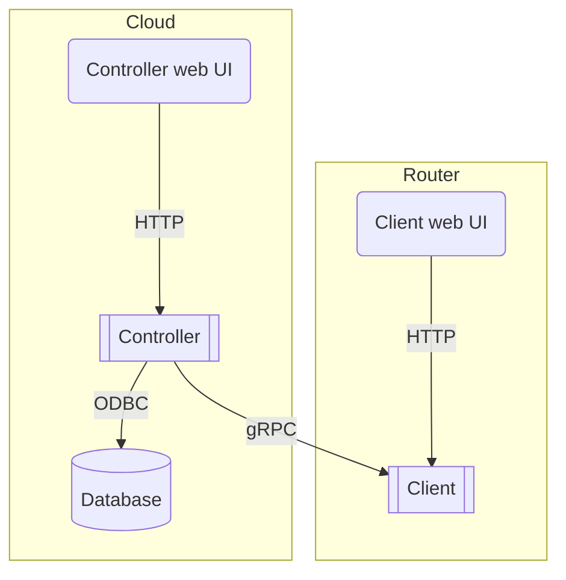

#

```mermaid
flowchart TB

subgraph Cloud
    con_webui(Controller web UI)
    controller[[Controller]]
    db[(Database)]
end

subgraph Router
    client[[Client]]
    client_webui(Client web UI)
end


client_webui ---> |HTTP| client
con_webui ---> |HTTP| controller 

controller --> |gRPC| client
controller --> |ODBC| db
```
